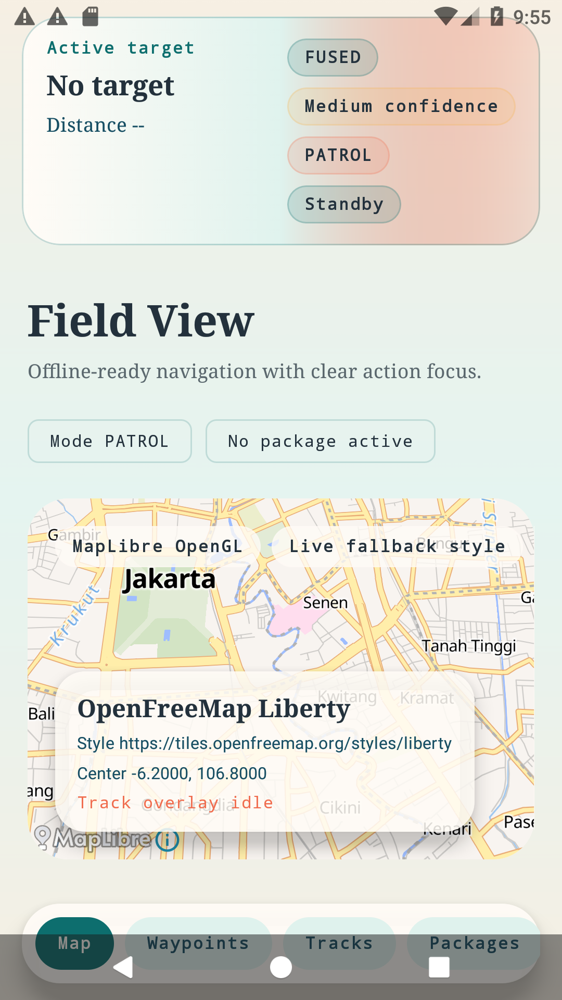
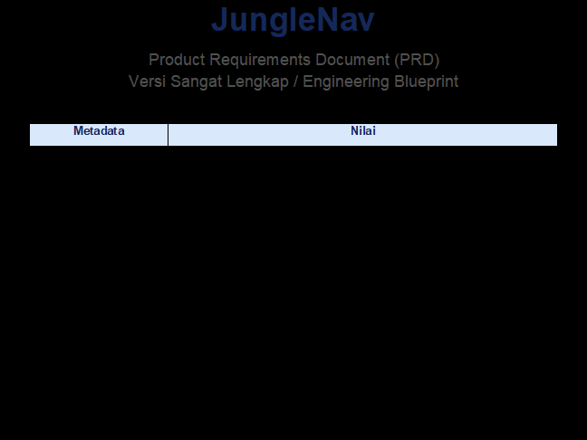

# 🌲 JungleNav

**JungleNav** is a professional-grade, offline-first navigation system designed for environments where connectivity is non-existent and GNSS accuracy is compromised by dense canopy or challenging terrain. 

Built with **Kotlin Native (Android)** and powered by **MapLibre GL**, JungleNav combines topographic maps with sensor fusion and dead reckoning to provide reliable orientation for SAR teams, researchers, and field operators.

---

## ✨ Key Features

- **📍 Offline-First Navigation**: Full topographic vector maps, contours, and hillshade available without an internet connection.
- **📡 Hybrid Sensor Fusion**: Combines GNSS, IMU (Inertial Measurement Unit), and barometer data for stable positioning.
- **🚶 Dead Reckoning**: Short-term position estimation when GNSS signal is lost or degraded.
- **🗺️ Mission Bundles (`.jnavpack`)**: Modular mission-area packages with manifest-driven assets, style resolving, and trust modeling.
- **🧭 Terrain-Aware Indicators**: Real-time confidence scores and honest source labels (GNSS vs. Fused vs. DR).
- **🔋 Battery-Optimized**: Adaptive sampling and power policies for multi-day field operations.
- **📊 Data Export**: Seamless GPX/KML/GeoJSON export for post-mission analysis.

---

## 🛠️ Tech Stack

- **Language**: [Kotlin 2.0](https://kotlinlang.org/)
- **UI Framework**: [Jetpack Compose](https://developer.android.com/compose)
- **Map Engine**: [MapLibre GL Android SDK](https://maplibre.org/)
- **Architecture**: Clean Architecture / MVVM with [AppContainer](file:///c:/Users/Arvy%20Kairi/AndroidStudioProjects/JungleNav/app/src/main/java/com/example/junglenav/app/AppContainer.kt)
- **Local Persistence**: [Room](https://developer.android.com/training/data-storage/room) & [DataStore](https://developer.android.com/topic/libraries/architecture/datastore)
- **Testing**: JUnit 4, Espresso, and custom Android Instrumentation smoke tests.

---

## 🚀 Getting Started

### Prerequisites
- Android Studio Ladybug (or newer)
- Android SDK 23 (Marshmallow) or higher
- A device with a magnetometer and barometer for full sensor-fusion capability.

### Installation
1. Clone the repository:
   ```bash
   git clone https://github.com/yourusername/JungleNav.git
   ```
2. Open the project in Android Studio.
3. Build and run on a physical device (recommended for sensor testing).

---

## 📸 Screenshots

| Map View | Mission Packages |
| :---: | :---: |
|  |  |

---

## 📝 Roadmap & Docs

Detailed documentation and planning can be found in the [docs/](file:///c:/Users/Arvy%20Kairi/AndroidStudioProjects/JungleNav/docs/) directory:
- [MVP Foundation](file:///c:/Users/Arvy%20Kairi/AndroidStudioProjects/JungleNav/docs/plans/2026-03-10-junglenav-mvp-foundation.md)
- [Hybrid Navigation Roadmap](file:///c:/Users/Arvy%20Kairi/AndroidStudioProjects/JungleNav/docs/plans/2026-03-10-junglenav-hybrid-navigation-roadmap.md)
- [Mission Bundles Specs](file:///c:/Users/Arvy%20Kairi/AndroidStudioProjects/JungleNav/docs/plans/2026-03-11-junglenav-jnavpack-mission-bundles.md)

---

## 🛡️ License

*This project is private and for internal use unless otherwise specified.*

---

**Built with ❤️ by [AuraDev] & Development Partner**
